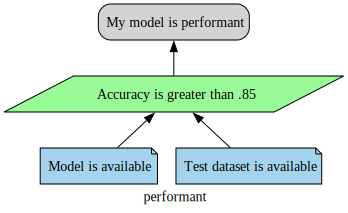
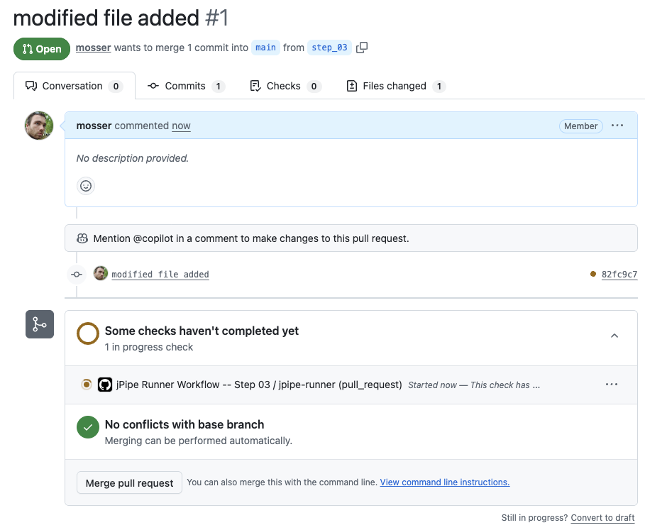
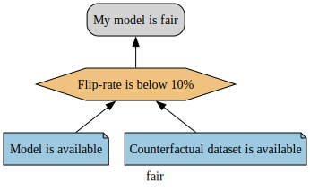

# JPipe - Barbados Edition

## How to install?

- compiler & execution environment
```
$ brew tap jpipe-mcscert/mcscert
$ brew install jpipe jpipe-runner
```

- VS Code plugin
  - https://marketplace.visualstudio.com/items?itemName=mcscert.jpipe-extension

## Step 1: My first justification model

- Code folder: `step_01`

Our objective here is to write our first justification model for an emotion detection classifier. We're looking for a performant model, and based on the state of the art, we define performance as _accuracy > .85_.

```
justification performant {
	conclusion c is "My model is performant"

	strategy s   is "Accuracy is greater than 85"
	s supports c

	evidence e1  is "Model is available"
	e1 supports s
	
    evidence e2  is "Test dataset is available"
	e2 supports s
}
```

This justification can be compiled into a graphical representation:

```
step_01 $ jpipe -d performant -i performant.jd -f svg \
                -o performant.svg
```

<div align="center">



</div>

## Step 2: Executing a justification

- Code folder: `step_02`

Our objective is to validate the claim we just made based on the evidence we can exhibit to support it. to do so, we need to provide code supporting:
1. checking that the model is available
2. checking that the test dataset is available
3. measuring the accuracy and validating it is greater than 0.85

**We will of course mock all these steps for the sake of the demo**

First step is to export the justification model into a JSON representation, so that it does not require the compiler anymore. 

```
$  jpipe -d performant -i performant.jd -f json \
         -o performant.json
```

Second step is to link all relevant nodes to executable code. the compiler can generate a code skeleton to accelerate this (we do not specify an output file with `-o` to avoid erasing the existing demo implementation).

```
$ jpipe -d performant -i performant.jd -f runner
```

Let's look at the pieces of evidence. We use a `mock` object instead of real model and dataset, but technically, it can be arbitrary Python code. The pieces of evidence:
  - are annotated using `jpipe` decorator
  - _produce_ an artifact (_e.g._, `model`, `tests`)
  - return `True` or `False` depending of their status

```python
@jpipe(produce=["model"])
def model_is_available(produce: Callable[[str, Any], None]) -> bool:
    if (found := 'model_file' in mock):
        produce('model', True)
    return found  

@jpipe(produce=["tests"])
def test_dataset_is_available(produce: Callable[[str, Any], None]) -> bool:
    if (found := 'test_dataset' in mock):
        produce('tests', True)
    return found  

```

The strategy _consumes_ the artifacts produced by the pieces of evidence supporting it. These elements are passed as parameter to the function. A strategy can also produce artifacts (here, the accuracy value). 

```python
@jpipe(consume=["model", "tests"], produce=["accuracy"])
def accuracy_is_greater_than_85(model: bool, tests: bool,
                                produce: Callable[[str, Any], None]) -> bool:
    if (ok := model and tests and mock['accuracy'] > 0.85):
        produce("accuracy", mock['accuracy'])
    return ok
```

We can now execute the validation of the claim, assuming a `mock` object containing dummy data

```python
mock = {
    'accuracy':     0.92,
    'model_file':   'https://huggingface.co/boltuix/bert-emotion',
    'test_dataset': 'tests.csv'
}
```

We can now execute the claim using the `jpipe-runner` command.

```
step_02 $ jpipe-runner --library steps/performant.py \
                       --diagram performant \
                       --format svg performant.json
    _ ____  _               ____                              
   (_)  _ \(_)_ __   ___   |  _ \ _   _ _ __  _ __   ___ _ __ 
   | | |_) | | '_ \ / _ \  | |_) | | | | '_ \| '_ \ / _ \ '__|
   | |  __/| | |_) |  __/  |  _ <| |_| | | | | | | |  __/ |   
  _/ |_|   |_| .__/ \___|  |_| \_\\__,_|_| |_|_| |_|\___|_|   
 |__/        |_|                                                                                     

==============================================================================
jPipe Files                                                                   
==============================================================================
jPipe Files.Justification :: performant                                       
==============================================================================
evidence<e1> :: Model is available                           | PASS |
------------------------------------------------------------------------------
evidence<e2> :: Test dataset is available                    | PASS |
------------------------------------------------------------------------------
strategy<s> :: Accuracy is greater than 85                   | PASS |
------------------------------------------------------------------------------
conclusion<c> :: My model is performant                      | PASS |
------------------------------------------------------------------------------
jPipe Files
1 justification, 4 passed, 0 failed, 0 skipped
==============================================================================
performant diagram saved to: performant.svg
```

Not using a supporting element inside the strategy will result in a warning.

```python
@jpipe(consume=["model", "tests"], produce=["accuracy"])
def accuracy_is_greater_than_85(model: bool, tests: bool,
                                produce: Callable[[str, Any], None]) -> bool:
    if (ok := model and mock['accuracy'] > 0.85): # missing `tests`
        produce("accuracy", mock['accuracy'])
    return ok
```


```
step_02 $ jpipe-runner --library steps/performant.py \
                       --diagram performant \
                       --format svg performant.json
...
  _____ ____  ____   ___  ____    _     ___   ____ 
 | ____|  _ \|  _ \ / _ \|  _ \  | |   / _ \ / ___|
 |  _| | |_) | |_) | | | | |_) | | |  | | | | |  _ 
 | |___|  _ <|  _ <| |_| |  _ <  | |__| |_| | |_| |
 |_____|_| \_\_| \_\\___/|_| \_\ |_____\___/ \____|
                                                   

WARNING - inject_arguments():97 - 2026-03-02 12:03:49,686 - Consumed variable 'tests' is declared but not used in function 'accuracy_is_greater_than_85'.
```

## Step 03: Looping in Continuous Integration

- Code folder: `step_03`
- Workflow: `.github/workflows/step_03.yml`

Objective: we want to check the claim each time a pull request is made. 

We just have to create a GitHub action workflow to start the runner when a pull request targeting this folder is made. The runner uses the justification file as the representation for the claim (json), and the python functions we implemented to support the claim execution.

```yaml
name: jPipe Runner Workflow -- Step 03
on:
  pull_request:
    paths:
      - 'step_03/**'

... clone repo, install python, ...

      - name: Run jPipe Runner
        uses: jpipe-mcscert/jpipe-runner@feat/v3.1.0
        with:
          version: feat/v3.1.0
          embed_image: "true"
          image_branch: "diagram-images"
          jd_file: step_03/performant.json
          library: step_03/steps/performant.py
          github-token: ${{ secrets.GITHUB_TOKEN }}

```

We can simulate a modification in the code and make a pull request.

```
step_03 $ git checkout -b step_03
step_03 $ touch modified_file.py
step_03 $ git add modified_file.py 
step_03 $ git commit -m "modified file added"  
step_03 $ git push
```

And create a pull request on Github. The runner is triggered as a regular validation.

<div align="center">



</div>

When the validation is done, the execution engine creates a comment in the pull request to indicate the status of the claim validation.

<div align="center">


</div>

To cleanup the branches:
```
git checkout main
git push -d origin step_03
git branch -D step_03
```

## Continuous evolution: Fairness matters

- Code folder: `step_04`
- Workflow: `.github/workflows/step_04.yml`

Objective: After review of our system, NLP experts are concerned by the fairness of the emotion detection model. They propose to use a counterfactual approach to evaluate fairness as a blackbox, and identify issues, that are then fixed in the training part.

They provide a new claim on how the model is considered fair:

```
justification fair {
	conclusion c_fair is "My model is fair"
	strategy s_fair   is "Assess counterfactual fairness"
	s_fair supports c_fair

	evidence e1_fair  is "Model is available"
	e1_fair supports s_fair
	evidence e2_fair  is "Counterfactual dataset is available"
	e2_fair supports s_fair
}
```

<div align="center">



</div>


We can now _assemble_ this new claim with the previous one, to claim that we can now deploy our model based on (1) performance and (2) fairness.

```
composition {
justification deployable is assemble(fair, performant) {
        conclusionLabel: 'Model is deployable'
        strategyLabel: 'All conditions are met'
    }
}
```

To get a graphical representation of the final claim:
```
step_04 $ jpipe -d deployable -i deployable.jd -f svg \
                -o deployable.svg
```

<div align="center">


</div>

The composition engine identified that two pieces of evidence were shared, and unified them.

We can now implement the missing steps to support the fairness evaluation.

```python
@jpipe(consume=["fair"])
def my_model_is_fair(produce: Callable[[str, Any], None]) -> bool:
    return True
   
@jpipe(consume=["counterfactual", "model"], produce=["fair"])
def assess_counterfactual_fairness(counterfactual: str, model: str,
                                   produce: Callable[[str, Any], None]) -> bool:
    produce('fair', True)
    return counterfactual and model


@jpipe(produce=["counterfactual"])
def counterfactual_dataset_is_available(produce: Callable[[str, Any], None]) -> bool:
    if (found := 'counterfacts' in mock):
        produce('counterfactual', True)
    return found  
```

For the sake of the demo, let's assume that the accuracy of the model decreased to 0.82 with the new fair training.

```python
mock = {
    'accuracy':     0.82,
    'model_file':   'https://huggingface.co/boltuix/bert-emotion',
    'test_dataset': 'tests.csv',
    'counterfacts': 'counterfacts.csv'
}
```

We can adapt the workflow to use the new justification, and push the code.

```
step_04 $ git checkout -b step_04
step_04 $ touch modified_file.py
step_04 $ git add modified_file.py 
step_04 $ git commit -m "Step 4 - modified file added"  
step_04 $ git push
```


